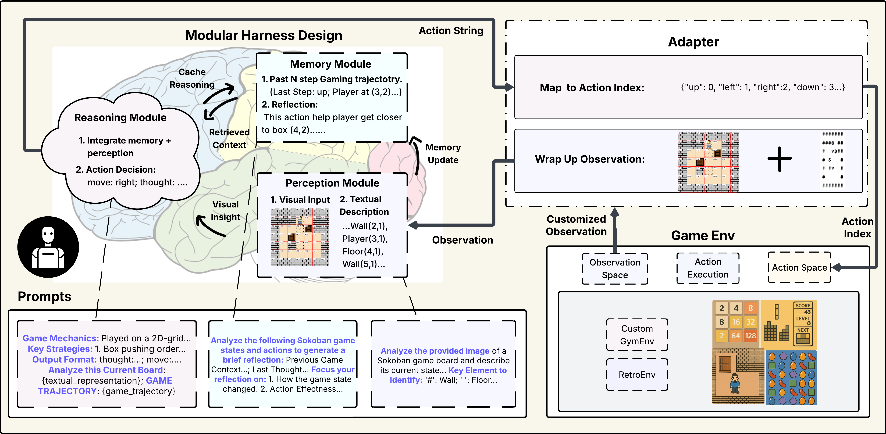

<p align="center">

</p>

<div align="center"> <h1>LMGame Bench and Gaming Agent</h1> </div> 
<p align="center"> <a href="https://arxiv.org/pdf/2505.15146"><b>📜 Paper</b></a> | <a href="https://huggingface.co/spaces/lmgame/game_arena_bench"><b>🏆 Leaderboard</b></a> | <a href="https://www.youtube.com/channel/UCmuHTmXPhmqYlzNySc6woFw"><b>📺 Gallery</b></a> | <a href="https://lmgame.org/#/gaming_agent"><b>🌐 Website</b></a></p>

## Introduction

This repo enables and tests LLM/VLM-based agents in standardized interctive gaming envrionments. It consists of two main features:
1. Evaluating state-of-the-art models with a suite of diverse video games in vanilla single-model VLM setting (without gaming harness).
2. Deploying and evaluating models with our customized GamingAgent workflow (gaming harness) to improve model gaming performance.

Our repo also provides an easy solution of deploying computer use agents (CUAs) for gaming that run on your PC and laptops. 

<p align="center">
  <picture>
  
  </picture>
</p>


## Contents
- [News](#News)
- [Installation](#installation)
- [APIs](#apis)
- [Lmgame Bench](#lmgame-bench)
  - [Setup](#setup)
  - [Single-Model Performance](#single-model-performance)
  - [Agentic Performance](#agentic-performance)
  - [Understanding Game Performance](#understanding-game-performance)
- [Computer-Use Gaming Agents](#computer-use-gaming-agents)
- [Add Your Own Games](#add-your-own-games)

## News 🔥

- [2025/6] Lmgame Bench is officially released! Check out our [paper](https://arxiv.org/pdf/2505.15146) and [leaderboard](https://huggingface.co/spaces/lmgame/game_arena_bench) for more details.
- [2025/3] We built gaming agents and tested different models on classical video games. See our [Youtube Channel](https://www.youtube.com/channel/UCmuHTmXPhmqYlzNySc6woFw) for side-by-side comparisons!

## Installation

1. Clone this repository:
```
git clone https://github.com/lmgame-org/GamingAgent.git
cd GamingAgent
```
2. Install dependency:
```
conda create -n lmgame python==3.10 -y
conda activate lmgame
pip install -e .
```

## APIs

Currently we support gaming agents based on the following models:

- OpenAI:
  - o4-mini
  - o3-mini, o3
  - o1
  - gpt-4o
  - gpt-4o-mini
- Anthropic:
  - claude-4-opus, claude-4-sonnet (with thinking mode)
  - claude-3-7-sonnet (with thinking mode)
  - claude-3-5-haiku, claude-3-5-sonnet
- Gemini:
  - gemini-2.5-pro, gemini-2.5-flash
  - gemini-2.0-flash-thinking-exp
  - gemini-2.0-pro, gemini-2.0-flash
  - gemini-1.5-pro
- xAI:
  - grok-3-mini
- Deepseek:
  - reasoner (R1)
  - chat (V3)
- Qwen:
  - Qwen3
 
Check out our [leaderboard](https://huggingface.co/spaces/lmgame/game_arena_bench) to see how their performances compare with each other!

To test the models yourself, set your API keys in `credentials.sh` with:

```
export OPENAI_API_KEY={YOUR_OPENAI_API_KEY}
export ANTHROPIC_API_KEY={YOUR_ANTHROPIC_API_KEY}
export GEMINI_API_KEY={YOUR_GEMINI_API_KEY}
export XAI_API_KEY={YOUR_XAI_API_KEY}
export DEEPSEEK_API_KEY={YOUR_DEEPSEEK_API_KEY}
```

⚠️ **Evaluating or deploying the agents with high-end models could incur higher costs!**

## Lmgame Bench

### Setup

#### Gym and Retro Interface

##### Gymnasium Envrionments

We standardize our gaming envrionment interfaces following [Gymnasium](https://github.com/Farama-Foundation/Gymnasium).

Currently our evaluation suite composes of the following games using gym envrionments:

- Sokoban
- Tetris
- 2048
- Candy Crush
- Pokemon Red

Most games are runnable out-of-the-box with no additional setup. For Pokemon Red, you need to place the ROM file in the designated directory:

**Pokemon Red Setup:**
- Place the Pokemon Red ROM file (`pokemon.gb`) in: `gamingagent/configs/custom_06_pokemon_red/rom/`
- We use pyboy as the Game Boy emulator to integrate Pokemon Red into the gymnasium environment

##### Retro Envrionments

Stable [Retro](https://github.com/Farama-Foundation/stable-retro) is a library that enables classic video game emulation through a wide range of supported systems, providing a standardized interface via Gymnasium.

To run classical games implemented on Retro, you need to legally obtain the games files and import them with [this instruction](https://stable-retro.farama.org/getting_started/):


```
python3 -m retro.import /path/to/your/ROMs/directory/
```


Currently, our evaluation suite includes the following games from Retro environments:
- Super Mario Bros 1985


We have also integrated additional Retro environments that are not included in stable-retro.
For these games, no `retro.import` is required. To enable the envrionments, simply place the ROM file into the designated directory.

For example, for Ace Attorney: Phoenix Wright, place the ROM file into:
```
gamingagent/envs/retro_02_ace_attorney/AceAttorney-GbAdvance
```

Additional games we integrated:
- Ace Attorney: Phoenix Wright

#### UI-only Interface

Coming Soon!


### Single-Model Performance

Launch multiple evaluation instances (in parallel) for a model on different games with the following commands:

```
python3 lmgame-bench/run.py --model_name {model_name} --game_names {list_of_games} --harness_mode false
```

To multiple models in parallel, run the following script:

```
bash lmgame-bench/evaluate_all.sh
```

### Agentic Performance

Evaluate a model's performance in gaming agent (with gaming harness support), run the following command:

```
python3 lmgame-bench/run.py --model_name {model_name} --game_names {list_of_games} --harness_mode true
```

##### Command options

```
--harness_mode: if to evaluate the model using agentic workflow, choice of ["true", "false", "both"].
--max_parallel_procs: max parallel instances to run.
--game_names: list of games to evaluated on, e.g. "sokoban,tetris,candy_crush,twenty_forty_eight".

Currently supported games:
- sokoban
- tetris
- candy_crush
- twenty_forty_eight
- super_mario_bros
- ace_attorney
```

### Customize Your Settings

`run.py` launches multiple instances of `custom_runner.py`. To run single model in a single game setting, run `python3 lmgame-bench/custom_runner.py --game_name {game_name} --model_name {model_name} --config_root_dir {path_to_gaming_agent_config} (--harness)`. 

Adjust gaming-agent related configurations in `gamingagent/configs/{game_env_dir}/config.yaml`. 

Propmts can be found in `gamingagent/configs/{game_env_dir}/module_prompts.json`.

### Understanding Game Performance

Access the [lmgame_bench_evaluation colab](https://colab.research.google.com/drive/1CYFiJGm3EoBXXI8vICPVR82J9qrmmRvc#scrollTo=6ICtS7MjUMNG) or use the [evaluation notebook](eval/lmgame_Bench_Evaluation_Pipeline.ipynb) to reproduce performance analysis from the paper.

Optional: Upload your generated cache directory to the colab workspace to visualize your model's performance compared to benchmark results.

#### Game replay Video Generation

Generate replay videos for Sokoban, 2048, Tetris, and Candy Crush games using agent config files and episode logs from your performance cache by using textual representation

```bash
python eval/video_generation_script.py --agent_config_path [CONFIG_PATH] --episode_log_path [LOG_PATH] --method text --output_path [OUTPUT_NAME] --fps 2
```

## Computer-Use Gaming Agents

We support computer-use gaming agents to run state-of-the-art models live on your local PCs and laptops! Check out [computer_use](computer_use) for detailed instructions!

## Add Your own Games

#### Gym and Retro Interface

1. You can follow instructions from [Gymnasium](https://gymnasium.farama.org/introduction/create_custom_env/) (for your own game implementation) or [Stable Retro](https://retro.readthedocs.io/en/latest/integration.html) (for existing classical games) to integrate a gaming environment with standarized interface. 

2. Navigate to [gamingagent/envs](gamingagent/envs). Set up your gaming environment to connect with an LLM/VLM gaming agent by implementing observation making and agent action processing methods.

3. Add your agent configuration to [configs](configs) so that a gaming agent can interface properly the envrionment.

More detailed instructions are provided in [gamingagent/envs](gamingagent/envs).

#### UI-only Interface

Coming Soon!

## Citation
If you find this repository helpful, Please kindly cite:
```
@article{hu2025lmgame,
  title={lmgame-Bench: How Good are LLMs at Playing Games?},
  author={Hu, Lanxiang and Huo, Mingjia and Zhang, Yuxuan and Yu, Haoyang and Xing, Eric P and Stoica, Ion and Rosing, Tajana and Jin, Haojian and Zhang, Hao},
  journal={arXiv preprint arXiv:2505.15146},
  year={2025}
}
```
