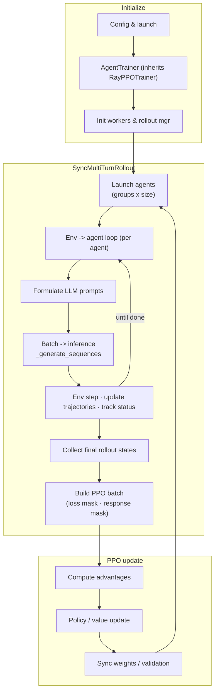

# System Design — LMGame Multi‑Turn PPO Training

This document describes the high‑level design of the training stack, with emphasis on the **multi‑turn rollout** path introduced by `AgentTrainer` and `SyncMultiTurnRollout`.

> Key idea: swap the single‑turn generation with a **synchronous multi‑turn rollout**, while leaving reward/advantage estimation and PPO updates unchanged.

---

## Architecture Overview



**Rollout Output Sample:**

Message 1: [SYSTEM]
    Content: ''You are a helpful AI assistant that solves Sokoban puzzles step by step.''
    Length: 72 chars
    ----------------------------------------

  Message 2: [USER]
    Content: '"You are solving the Sokoban puzzle. You are the player and you need to push all boxes to targets. When you are right next to a box, you can push it by moving in the same direction. You cannot push a box through a wall, and you cannot pull a box. The answer should be a sequence of actions, like <answer>Right || Right || Up</answer>.\nThe meaning of each symbol in the state is:\n #: wall, _: empty, O: target, √: box on target, X: box, P: player, S: player on target\nYour available actions are:\nUp, Down, Left, Right\nYou can make up to 10 actions, and each action is separated by '||'.\nTurn 1:\nState:\n######\n######\n##_O##\n##_XP#\n##___#\n######\nYou have 10 actions remaining. Always output: <think> [Your thoughts] </think> <answer> [your answer] </answer> with no extra text. Strictly follow this format. Max response length: 100 tokens.\n"'
    Length: 836 chars
    ----------------------------------------

  Message 3: [ASSISTANT]
    Content: ''<think>To push all boxes to targets X, I need to locate the boxes first. I can do that by exploring the grid. The target would be the last move I made. I need to follow the grid to find the boxes.</think><answer>Up | Right | Down</answer>''
    Length: 238 chars
    ----------------------------------------

  Message 4: [USER]
    Content: ''Reward: 0 Turn 2:\nState:\n######\n######\n##_O##\n##_XP#\n##___#\n######\nYou have 10 actions remaining. Always output: <think> [Your thoughts] </think> <answer> [your answer] </answer> with no extra text. Strictly follow this format. Max response length: 100 tokens.\n''
    Length: 261 chars
    ----------------------------------------

  Message 5: [ASSISTANT]
    Content: '"<think>Exploring the grid, I find a target. I can push it using the Up action. I now need to find the box on the target. I can't directly see it but can check if I can push it in the Up direction. I will use the Right action to move closer, and Check action to see if the box is in the right place.</think><answer>Right | Right | Right | Right | Right | | Check | Right | Check | Right |</answer>"'
    Length: 396 chars
    ----------------------------------------


## Key Design Decisions

### 1. Inheritance Strategy
- **Inherit from RayPPOTrainer**: Maintains compatibility with existing VERL infrastructure
- **Minimal modifications**: Only replace the generation logic, keep everything else the same
- **Clean separation**: Multi-turn logic is encapsulated in `SyncMultiTurnRollout`

### 2. Agent Registration System
- **Agent Registry**: Agents are registered using `@register_agent("agentName")` decorator
- **Automatic Resolution**: Agent class is automatically resolved from config
- **Flexible Configuration**: Agent configs defined in YAML format

### 3. Main Modification Points

The implementation highlights three key modifications compared to the original `RayPPOTrainer`:

#### **1. Multi-turn Rollout Generation** (`_generate_multi_turn_sequences`)
```python
# ─────────────────── MODIFICATION: Multi-turn rollout generation replaces single-turn generation ───────────────────
def _generate_multi_turn_sequences(self, gen_batch: DataProto) -> tuple[DataProto, dict]:
    # Initialize multi-turn rollout if not already done
    if self.multi_turn_rollout is None:
        self.init_multi_turn_rollout()
    
    # Run multi-turn rollout to get complete trajectories
    self.multi_turn_rollout.rollout()
    
    # Build update batch containing full trajectories and rewards
    final_rollout_states = self.multi_turn_rollout._collect_final_rollout_states()
    rollout_batch = self.multi_turn_rollout.build_ppo_batch(final_rollout_states)
    
    rollout_batch, filter_metrics = self.multi_turn_rollout.filter_rollout(rollout_batch)
    
    return rollout_batch, filter_metrics
# ─────────────────── END MODIFICATION ───────────────────
```

#### **2. Multi-turn Validation** (`_validate`)
```python
# ─────────────────── MODIFICATION: Multi-turn rollout validation replaces val_dataloader validation ───────────────────
def _validate(self):
    # Uses multi-turn rollout for validation instead of val_dataloader
    # Calculates total_validation_agents = agent_group_num * agent_group_size
    # Runs self.multi_turn_rollout.rollout() for validation steps
    # Returns environment metrics with "val-env/" prefix
# ─────────────────── END MODIFICATION ───────────────────
```

#### **3. Main Training Loop Modification** (`fit`)
```python
# ─────────────────── MODIFICATION: Multi-turn rollout generation replaces actor_rollout_wg.generate_sequences ───────────────────
# Original: batch = self.actor_rollout_wg.generate_sequences(gen_batch)
# Modified: batch, rollout_metrics = self._generate_multi_turn_sequences(gen_batch)
# ─────────────────── END MODIFICATION ───────────────────
```

## Implementation Status ✅

### Step 1: AgentTrainer Implementation ✅
```python
class AgentTrainer(RayPPOTrainer):
    def __init__(self, config, tokenizer, role_worker_mapping, 
                 resource_pool_manager, processor=None, **kwargs):
        # Agent class is automatically determined from config
        super().__init__(...)
        self.multi_turn_rollout = None  # Initialized later
```

### Step 2: SyncMultiTurnRollout Implementation ✅
```python
class SyncMultiTurnRollout:
    def __init__(self, actor_rollout_wg, cfg, tokenizer, processor):
        # Agent class resolved automatically from config
        self.agent_cls = get_agent_cls(agent_name)
        self.agents = [self.agent_cls(config=self.agent_config, 
                                     agent_id=idx, group_id=group_id)
                       for idx in range(self.n_agents)]
    
    def rollout(self):
        # Multi-turn rollout loop
        for turn in range(self.max_turns):
            if self.done_mask.all():
                break
            batch_prompts = self.get_batch_llm_prompts(self.env_outs)
            lm_outputs = self.generate_sequences(batch_prompts)
            self.env_outs = self.get_batch_env_outputs(lm_outputs)
```

### Step 3: Agent Implementation ✅
```python
@register_agent("sokobanAgent")
class SokobanAgent:
    def __init__(self, config, group_id=0, agent_id=0, seed=None, tag=None):
        # Agent configuration and environment setup
        
    def get_llm_prompts(self, env_out):
        # Convert environment outputs to LLM prompts
        
    def get_env_outputs(self, llm_response):
        # Process LLM outputs and get environment outputs
        
    def get_final_rollout_states(self):
        # Get final rollout states for PPO training
```

### Step 4: Training Script Modifications ✅
```python
# train.py modifications:
# ─────────────────── MODIFICATION: Import AgentTrainer instead of RayPPOTrainer ───────────────────
from trainer.agent_trainer import AgentTrainer

# ─────────────────── MODIFICATION: DummyRewardManager replaces load_reward_manager ───────────────────
class DummyRewardManager():
    # Custom reward manager implementation

# ─────────────────── MODIFICATION: Initialize AgentTrainer instead of RayPPOTrainer ───────────────────
trainer = AgentTrainer(
    config=config,
    tokenizer=tokenizer,
    # ... other arguments
    train_dataset=None,  # No datasets needed for agent-based training
    val_dataset=None,
)
```

## Configuration Requirements

The config should contain everything needed for:
1. **Standard PPO**: All existing RayPPOTrainer parameters
2. **Multi-turn rollout**: Agent configuration parameters
3. **Agent-specific settings**: Environment templates, max turns, etc.

Example base config structure:
```yaml
# Base configuration for PPO training with Sokoban agents
# This configuration follows the hydra structure with defaults and overrides
# ------ Hydra Config ------

defaults:
  - agents
  - ppo_trainer

system:
  CUDA_VISIBLE_DEVICES: 0

# ------ Rollout Configuration ------
rollout:
  agent_group_num: 8
  agent_group_size: 16 # number of agents = agent_group_num * agent_group_size
  validation_agent_group_num: 16
  validation_agent_group_size: 16
  train: [sokobanAgent]
  validation: [sokobanAgent]
  truncation: left  # truncate from left (oldest tokens) to keep recent context
  use_turn_scores: False  # for GAE computation
  rollout_filter_ratio: 0.25  # filter ratio for rollout selection
  rollout_filter_type: std  # std or std_rev for filtering criteria
  reward_normalization:
    grouping: "state" # state / batch / inductive
    method: "identity" # asym_clip / identity / mean_std

# ------ Training Parameters ------
train_batch_size: 128
micro_batch_size_per_gpu: 4
ppo_micro_batch_size_per_gpu: 4
ppo_mini_batch_size: 32
total_training_steps: 200
n_gpus_per_node: 1
max_prompt_length: 4096
max_response_length: 400
test_freq: 10
model_path: Qwen/Qwen2.5-0.5B-Instruct
project_name: lmgame
experiment_name: sokoban_train_example

# ------ PPO_trainer Override Config ------
actor_rollout_ref:
  model:
    path: ${model_path}
  actor:
    ppo_mini_batch_size: ${ppo_mini_batch_size}  # by default, ppo_mini_batch_size = train_batch_size / 4
    micro_batch_size_per_gpu: ${micro_batch_size_per_gpu} # following micro_batch_size_per_gpu
    ppo_micro_batch_size_per_gpu: ${micro_batch_size_per_gpu} # following micro_batch_size_per_gpu
    use_ref: True
    entropy_coeff: 0.001
    # use_kl_loss: False
    kl_loss_coef: 0.001
    kl_loss_type: kl
    clip_ratio_low: 0.2
    clip_ratio_high: 0.28
    optim:
      betas: [0.9, 0.999]
  ref:
    log_prob_micro_batch_size_per_gpu: ${micro_batch_size_per_gpu} # following micro_batch_size_per_gpu
  rollout:
    log_prob_micro_batch_size_per_gpu: ${micro_batch_size_per_gpu} # following micro_batch_size_per_gpu
    tensor_model_parallel_size: 1
    max_model_len: 20000
    prompt_length: 1 # useless. Just put it here
    response_length: 400 # single-turn response length
    gpu_memory_utilization: 0.5
    max_num_batched_tokens: 20000 # set only when enable_chunked_prefill is true
    temperature: 1
    rollout_filter_ratio: 0.25
    rollout_filter_type: std # max_mean or std
    enforce_eager: True
    free_cache_engine: True
    val_kwargs:
      do_sample: False
      temperature: 0

critic:
  ppo_mini_batch_size: ${ppo_mini_batch_size} # by default, ppo_mini_batch_size = train_batch_size / 4
  ppo_micro_batch_size_per_gpu: ${micro_batch_size_per_gpu} # following micro_batch_size_per_gpu
  model:
    path: ${model_path}
  optim:
    betas: [0.9, 0.999]

data:
  max_prompt_length: ${max_prompt_length}
  max_response_length: ${max_response_length}
  train_batch_size: ${train_batch_size}

algorithm:
  gamma: 1.0
  lam: 1.0
  adv_estimator: gae
  kl_penalty: kl  # how to estimate kl divergence
  use_kl_in_reward: True
  kl_ctrl:
    type: fixed
    kl_coef: 0.001

trainer:
  project_name: lmgame
  experiment_name: sokoban_train_example
  total_training_steps: ${total_training_steps}
  validation_steps: 1 # validation instances = validation_steps * val_env_groups * group_size
  val_before_train: True
  n_gpus_per_node: ${n_gpus_per_node}
  test_freq: ${test_freq}
  logger: [ 'console', 'wandb' ] # 
  val_only: False
```
Example agent config structure:
```yaml
# ------ Sokoban Agent & Env Configs ------
sokobanAgent:
  agent_config:
    system_prompt: "You are a helpful AI assistant that solves Sokoban puzzles step by step."
    prompt: "You are solving the Sokoban puzzle. You are the player and you need to push all boxes to targets. When you are right next to a box, you can push it by moving in the same direction. You cannot push a box through a wall, and you cannot pull a box. The answer should be a sequence of actions, like <answer>Right || Right || Up</answer>."
    max_tokens: 100 # used to curate llm prompt "max words", not used for rollout
    enable_think: True  # enable thinking before answering
    max_turns: 6
    max_actions_per_turn: 5
    max_actions_all_turns: 10
    format_penalty: -0.1
    action_separator: "||"

  env_config:
    dim_room: [6, 6]
    num_boxes: 1
    max_steps: 100
    search_depth: 100  # Reduced from 300 to make simpler puzzles
    grid_lookup: {0: "#", 1: "_", 2: "O", 3: "√", 4: "X", 5: "P", 6: "S"}
    grid_vocab: {"#": "wall", "_": "empty", "O": "target", "√": "box on target", "X": "box", "P": "player", "S": "player on target"}
    action_lookup: {1: "Up", 2: "Down", 3: "Left", 4: "Right"}
    render_mode: "text"

```
## Usage Example

```python
# The agent class is automatically resolved from config
# No need to explicitly pass agent_cls

# Initialize trainer
trainer = AgentTrainer(
    config=config,
    tokenizer=tokenizer,
    role_worker_mapping=role_worker_mapping,
    resource_pool_manager=resource_pool_manager,
    processor=processor,
    reward_fn=reward_fn,
    val_reward_fn=val_reward_fn,
    train_dataset=None,  # Agent-based training doesn't use datasets
    val_dataset=None,
    collate_fn=collate_fn,
    train_sampler=None,
)

# Initialize workers (PPO + multi-turn rollout)
trainer.init_workers()

# Train with multi-turn rollouts
trainer.fit()
```

## Key Features

### 1. Agent Registration System
- Agents are registered using `@register_agent("agentName")` decorator
- Agent class is automatically resolved from config
- Supports multiple agent types through registry

### 2. Multi-Agent Rollouts
- Supports batch processing of multiple agents
- Agents are grouped for training purposes (`agent_group_num` × `agent_group_size`)
- Each agent manages its own environment and history

### 3. Flexible Reward Management
- Custom `DummyRewardManager` for reward computation
- Supports environment-based rewards through agent metrics
- Configurable reward normalization and filtering

### 4. Environment Integration
- Agent-environment interface through `get_llm_prompts()` and `get_env_outputs()`
- Support for complex environments like Sokoban
- Configurable action spaces and state representations

## Benefits

1. **Minimal Changes**: Only replaces the generation step, everything else stays the same
2. **Compatibility**: Maintains full compatibility with existing PPO infrastructure
3. **Flexibility**: Easy to switch between single-turn and multi-turn training
4. **Extensibility**: Can easily add more complex multi-turn logic without affecting PPO
5. **Agent-Centric**: Each agent manages its own environment and history internally
6. **Modular Design**: Clean separation between PPO training and agent management

## Implementation Complete ✅

The implementation is fully functional with:
- ✅ Complete `AgentTrainer` class with all modifications
- ✅ Full `SyncMultiTurnRollout` implementation
- ✅ Example `SokobanAgent` with environment integration
- ✅ Updated training script with proper imports and configurations
- ✅ Agent registration system for extensibility
- ✅ Multi-turn validation support
- ✅ Rollout filtering and reward normalization

## Key Insight

The core insight is that we only need to replace **one function call** in the entire PPO pipeline:
- `self.actor_rollout_wg.generate_sequences()` → `self._generate_multi_turn_sequences()`
- Everything else (rewards, advantages, policy updates) remains exactly the same
- This makes the modification both simple and robust 
